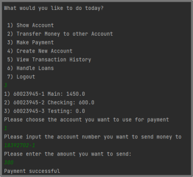

# University of Bath - Software Engineering 2 - February 2022 - Group 7
## Our Trello Board
[https://trello.com/b/sZSQf5cQ/agile-board-bath-software-engineering-2](https://trello.com/b/sZSQf5cQ/agile-board-bath-software-engineering-2)
## About the Database
The program stores the encrypted data to the database, and reads the encrypted data from the database.  
The unencrypted initial database can be found in this folder:  
[Unencrypted Initial Database](supplementary_files/unencrypted_initial_database)  
Note that the files in this folder are just for reference. They are **EXCLUDED** from the program.
## How to Use the Program
### Transfer

### Payment

### Micro-loan

## Supplementary Documents
[User Interaction Specification](supplementary_files/user_interaction_specification.pdf)  
[Micro-loan Explanation](supplementary_files/micro-loan_explanation.pdf)